# Documentação do Sistema

## SUMÁRIO
- [Dados do Cliente](#dados-do-cliente)
- [Equipe de Desenvolvimento](#equipe-de-desenvolvimento)
- [1. Introdução](#1-introdução)
- [2. Objetivo](#2-objetivo)
- [3. Escopo](#3-escopo)
- [4. Backlogs do Produto](#4-backlogs-do-produto)
- [5. Cronograma](#5-cronograma)
- [6. Materiais e Métodos](#6-materiais-e-métodos)
- [7. Resultados](#7-resultados)
- [8. Conclusão](#8-conclusão)
- [9. Homologação do MVP junto ao cliente](#9-homologação-do-mvp-junto-ao-cliente)
- [10. Divulgação](#10-divulgação)
- [11. Carta de Apresentação](#11-carta-de-apresentação)
- [12. Carta de Autorização](#12-carta-de-autorização)
- [13. Relato individual do processo](#13-relato-individual-do-processo)

---

## Dados do Cliente

**Título do Projeto:** Chocomeire - Um site para gerenciamento de encomendas de doces

**Cliente:** Edimeire Bezerra Romagnoli

**CNPJ/CPF:**  51.609.434/0001-24

**Contato:** (19) 99456-4187

**Email do contato:** meire_venditoo@hotmail.com

---

## Equipe de Desenvolvimento

| Nome completo       | Curso              | Disciplina                 |
|---------------------|--------------------|----------------------------|
|João Victor Romagnoli Vendito | Ciência da Computação  | Programação Orientada a Objetos em JAVA                           |
|João Paulo da Silva Júnior    | Ciência da Computação  | Programação Orientada a Objetos em JAVA                           |

**Professor Orientador:** Kesede Rodrigues Junior

---

## 1. Introdução 💡

O cliente identificou dificuldades no controle e organização das encomendas de doces, como anotações manuais, esquecimentos de pedidos e falta de acompanhamento eficaz. Para solucionar isso, será desenvolvido um sistema web de gerenciamento de pedidos que permita registrar, acompanhar e organizar as encomendas de forma centralizada.

---

## 2. Objetivo 📌

Criar um site dinâmico e eficiente para o gerenciamento de encomendas de doces, atendendo às necessidades tanto dos clientes quanto dos proprietários do negócio. A plataforma será um ambiente digital, onde os usuários poderão realizar encomendas de doces personalizados com facilidade e praticidade, enquanto o proprietário terá controle total sobre os pedidos, o estoque e o fluxo de trabalho.

---

## 3. Escopo 🎯

### Funcionalidades para Clientes
- **Cadastro e Login:** Autenticação segura para clientes.
- **Catálogo de Produtos:** Visualização de doces disponíveis com descrição e preços.
- **Carrinho de Compras:** Gerenciamento de itens adicionados ao carrinho.
- **Finalização de Pedidos:** Confirmação de compra e cálculo do total com resumo do pedido.
- **Rastreamento de Pedidos:** Status do pedido (ex.: "em preparo" ou "entregue").

### Funcionalidades para Administradores (Confeiteiros)
- **Login Administrativo:** Acesso seguro ao painel de controle.
- **Gerenciamento de Produtos:** Adicionar, editar ou remover doces no catálogo.
- **Visualização de Pedidos:** Lista de pedidos feitos pelos clientes com detalhamento.
- **Atualização de Status:** Controle do progresso do pedido.

---

## Tecnologias e Ferramentas
- **Linguagem de Programação:** Python.
- **Framework:** Flask (para construir o back-end e estruturar o site).
- **Banco de Dados:** SQLite (leve e integrado, perfeito para começar).
- **ORM:** SQLAlchemy (orientação a objetos para interação com o banco de dados).

---

## Estrutura do Banco de Dados

### Tabelas principais
1. **Clientes**
   - `id`: Chave primária, único.
   - `nome`: Nome do cliente.
   - `email`: Email do cliente.
   - `senha`: Hash para segurança.

2. **Produtos**
   - `id`: Chave primária, único.
   - `nome`: Nome do produto.
   - `descrição`: Descrição detalhada do doce.
   - `preco`: Preço unitário.
   - `quantidade_disponível`: Estoque disponível.

3. **Pedidos**
   - `id`: Chave primária, único.
   - `id_cliente`: Chave estrangeira para a tabela de clientes.
   - `id_produto`: Chave estrangeira para a tabela de produtos.
   - `quantidade`: Quantidade do produto.
   - `preco_total`: Preço total do pedido.
   - `status`: Status do pedido (ex.: "em preparo", "pronto", "entregue").

---

## Fluxo de Desenvolvimento

### Fase 1: Planejamento
- Mapear os requisitos detalhados (ex.: número de páginas, funcionalidades adicionais).
- Criar protótipos simples do layout e fluxo.

### Fase 2: Desenvolvimento
1. **Configuração do ambiente**
   - Criar o projeto Flask e instalar dependências (Flask, SQLAlchemy, Flask-WTF, etc.).
   - Configurar o banco de dados SQLite.

2. **Implementação**
   - Criar as classes Python (ex.: Cliente, Produto, Pedido) e mapear com SQLAlchemy.
   - Desenvolver rotas Flask (ex.: `/novo_pedido`, `/listar_produtos`).
   - Utilizar templates HTML e CSS para o front-end.

### Fase 3: Testes
- Validar o sistema de login e segurança.
- Testar rotas, funcionalidades e integração com banco de dados.
- Garantir que o design seja responsivo.

### Fase 4: Implantação
- Realizar testes de produção para confirmar funcionalidade.

### Fase 5: Feedback e Ajustes
- Coletar opiniões de usuários e confeiteiros.
- Corrigir erros e implementar melhorias conforme necessário.

---

## Resultados Esperados
- Um sistema funcional e intuitivo.
- Gestão eficiente de pedidos de doces e catálogo de produtos.
- Escalabilidade para adicionar novas funcionalidades no futuro.

## 4. Backlogs do Produto 📋

## 1. Configuração Inicial
### Épico: Configuração do Ambiente
- **Tarefa:** Criar o repositório do projeto.
- **Tarefa:** Configurar o ambiente Flask.
  - *Subtarefa:* Instalar Flask, SQLAlchemy e outras dependências.
  - *Subtarefa:* Configurar SQLite como banco de dados local.
- **Tarefa:** Criar estrutura básica de diretórios (ex.: templates, static, models).

## 2. Desenvolvimento do Back-end
### Épico: Implementação das Classes e Banco de Dados
- **Tarefa:** Criar classe `Cliente` com SQLAlchemy.
- **Tarefa:** Criar classe `Produto` com SQLAlchemy.
- **Tarefa:** Criar classe `Pedido` com SQLAlchemy.
  - *Subtarefa:* Configurar tabelas e chaves primárias/estrangeiras.
- **Tarefa:** Implementar métodos específicos nas classes (ex.: cálculo do total do pedido).

### Épico: Desenvolvimento das Rotas Flask
- **Tarefa:** Criar rota `/cadastro_cliente`.
- **Tarefa:** Criar rota `/login_cliente`.
- **Tarefa:** Criar rota `/listar_produtos`.
- **Tarefa:** Criar rota `/novo_pedido`.
- **Tarefa:** Criar rota `/atualizar_status_pedido`.

## 3. Desenvolvimento do Front-end
### Épico: Design Responsivo
- **Tarefa:** Criar layout básico usando Bootstrap/Tailwind CSS.
  - *Subtarefa:* Design da página inicial.
  - *Subtarefa:* Design da página de catálogo de produtos.
  - *Subtarefa:* Design da página de carrinho de compras.

### Épico: Integração Front-end com Back-end
- **Tarefa:** Utilizar templates Jinja2 para renderizar dados do back-end.
- **Tarefa:** Implementar formulários HTML para cadastro e login (usando Flask-WTF).

## 4. Funcionalidades Adicionais
### Épico: Implementação de Autenticação
- **Tarefa:** Criar sistema de autenticação com hash de senha (ex.: werkzeug.security).
- **Tarefa:** Implementar validação de sessões para acesso seguro ao site.

### Épico: Carrinho e Pagamento
- **Tarefa:** Implementar funcionalidade de carrinho.
- **Tarefa:** Integrar com APIs de pagamento (opcional).

## 5. Testes e Validação
### Épico: Testes Automatizados
- **Tarefa:** Escrever testes para rotas Flask (ex.: com pytest ou unittest).
- **Tarefa:** Validar a interação do sistema com o banco de dados.

### Épico: Feedback do Usuário
- **Tarefa:** Criar ambiente de testes para coletar sugestões dos clientes/confeiteiros.
- **Tarefa:** Implementar melhorias com base no feedback.

## 6. Implantação
### Épico: Hospedagem e Configuração
- **Tarefa:** Configurar o projeto no PythonAnywhere.
  - *Subtarefa:* Subir o código para o servidor.
  - *Subtarefa:* Configurar o banco de dados remoto SQLite.

### Épico: Monitoramento
- **Tarefa:** Configurar logs no servidor para monitorar erros.
- **Tarefa:** Implementar ferramentas de análise de uso, como Google Analytics.

## 7. Marketing e Expansão
### Épico: Divulgação
- **Tarefa:** Criar contas nas redes sociais para promover o CHOCOMEIRE.
- **Tarefa:** Desenvolver páginas dedicadas para promoções e contato.

---

## 5. Cronograma 📅

## 🗓️ Cronograma do Projeto

| Etapa               | Descrição                             | Data de Início | Data de Término | Status     |
|---------------------|----------------------------------------|----------------|------------------|------------|
| Planejamento        | Mapear requisitos detalhados  | 14/04/2025 | 28/04/2025      | ✅ Concluída  |
| Desenvolvimento              | Criar as classes Python, desenvolver rotas Flask      | 24/04/2025     | 15/05/2025    | ✅ Concluída |
| Desenvolvimento              | Utilizar Templates HTML e CSS para o front-end     | 24/04/2025     | 15/05/2025    | ✅ Concluída |
| Design   | Criar Layout e fluxo do site     | 24/04/2025    | 15/05/2025     | ✅ Concluída |
| Testes              |  Validar sistema de login e segurança, testar rotas, funcionalidades e integração com banco de dados, garantir que o design seja responsivo         | 30/04/2025     | 15/05/2025      | ✅ Concluída |
|  |           |     |         |                                                                                   |
|          |   |   |     | |


---


## 6. Materiais e Métodos  🧰

### Modelagem do Sistema
- Diagrama de Casos de Uso
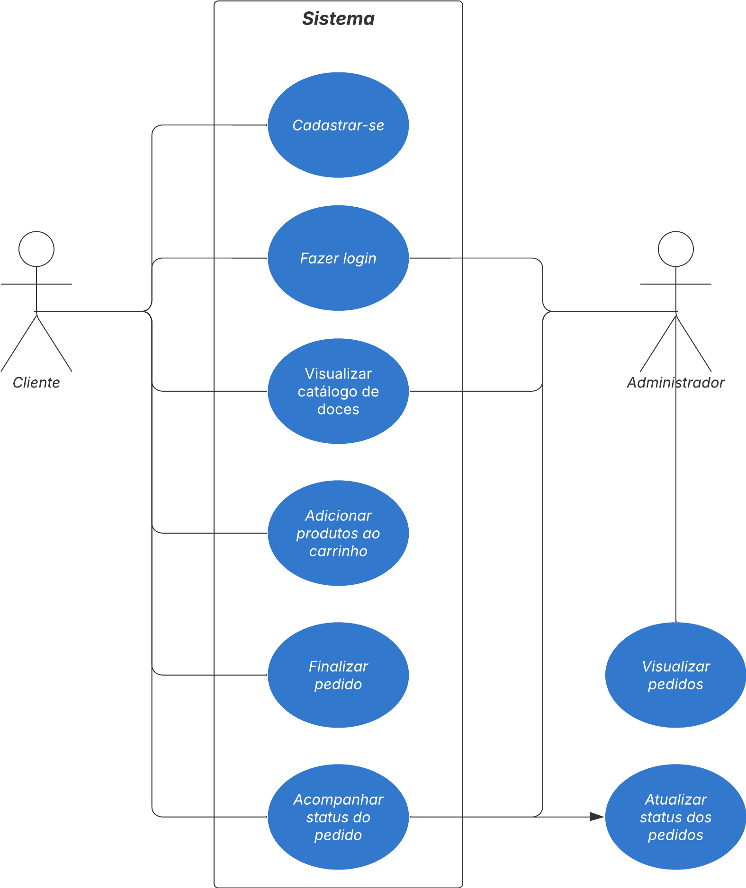

- Diagrama de Classes
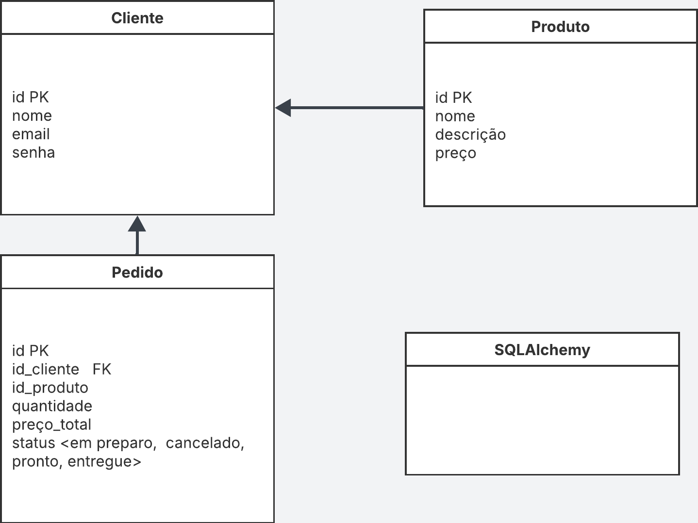

### Tecnologias Utilizadas
- **Python + Flask**: Backend
- **HTML/CSS/JS**: Interface do usuário
- **SQLite/**: Banco de dados
- **SQLAlchemy/**: orientação a objetos
- **Lucidchart/Draw.io**: Criação dos diagramas


## 7. Resultados 📈

### Protótipo e códigos das principais funcionalidades

Aqui estão as telas do sistema:

#### Tela Inicial
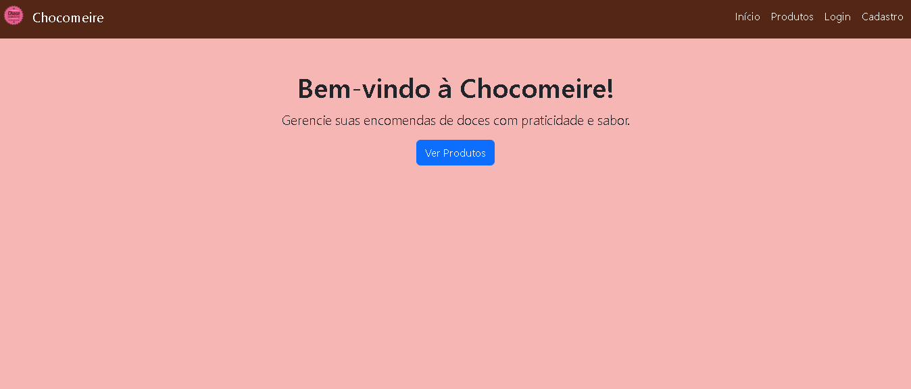
```html
<!-- Página inicial: boas-vindas e botão para visualizar os produtos -->

<main class="container text-center mt-5">
    <!-- Título de boas-vindas -->
    <h1>Bem-vindo à Chocomeire!</h1>

    <!-- Descrição da proposta do site -->
    <p>Gerencie suas encomendas de doces com praticidade e sabor.</p>

    <!-- Botão que redireciona para a lista de produtos -->
    <a href="/produtos" class="btn btn-primary">Ver Produtos</a>
</main>
```

#### Tela de Produtos
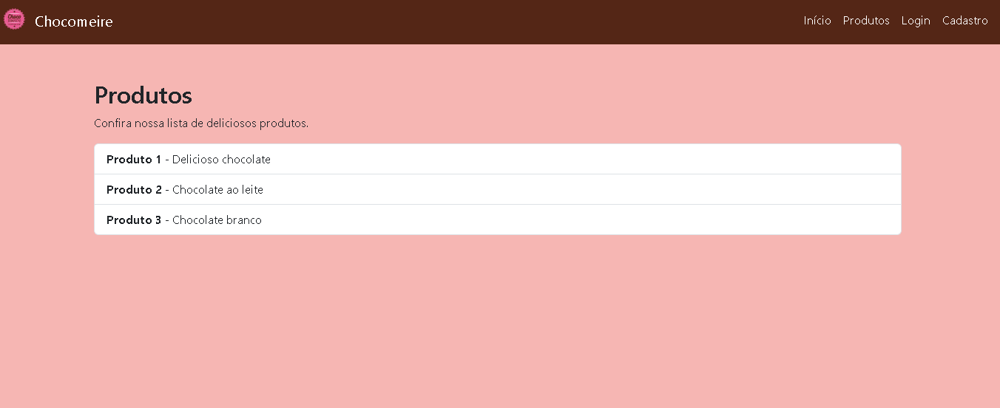
```html



<div class="container mt-5">
    <h2>Produtos</h2>
    <p>Confira nossa lista de deliciosos produtos.</p>
    <ul class="list-group">
        
            <li class="list-group-item">
                <strong>{{ produto.nome }}</strong> - {{ produto.descricao }}
            </li>
        
    </ul>
</div>

```
#### Tela de Login
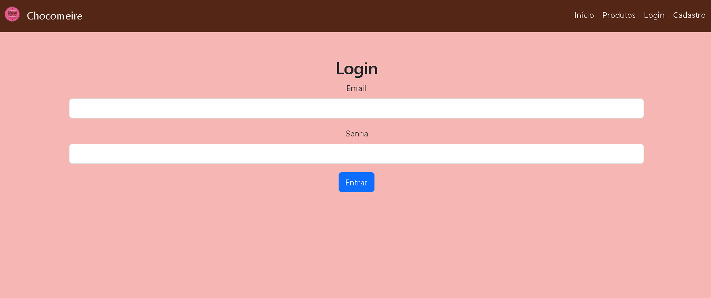
```html
<main class="container text-center mt-5">
    <h1>Login</h1>
    <p>Entre com suas credenciais para acessar sua conta.</p>
    <form method="POST" action="/login">
        <div class="mb-3">
            <label for="email" class="form-label">Email</label>
            <input type="email" class="form-control" id="email" name="email" required>
        </div>
        <div class="mb-3">
            <label for="senha" class="form-label">Senha</label>
            <input type="password" class="form-control" id="senha" name="senha" required>
        </div>
        <button type="submit" class="btn btn-primary">Entrar</button>
    </form>
</main>
```
#### Tela de Cadastro
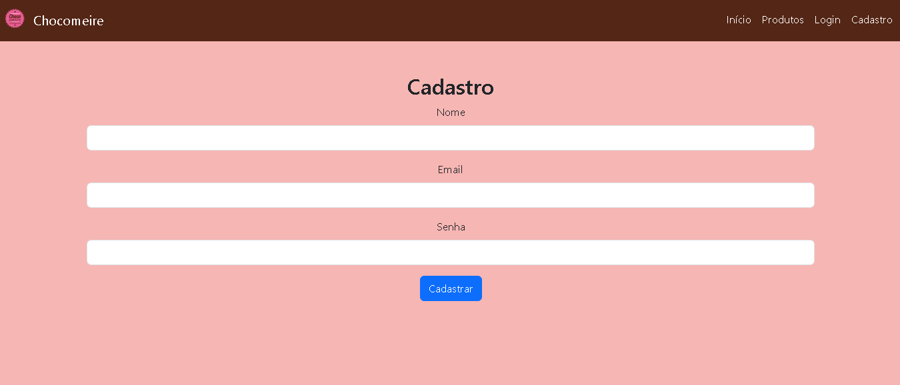
```html



<div class="container text-center mt-5">
    <h2>Cadastro</h2>
    <form method="POST" action="/cadastro">
        <div class="mb-3">
            <label for="nome" class="form-label">Nome</label>
            <input type="text" class="form-control" id="nome" name="nome" required>
        </div>
        <div class="mb-3">
            <label for="email" class="form-label">Email</label>
            <input type="email" class="form-control" id="email" name="email" required>
        </div>
        <div class="mb-3">
            <label for="senha" class="form-label">Senha</label>
            <input type="password" class="form-control" id="senha" name="senha" required>
        </div>
        <button type="submit" class="btn btn-primary">Cadastrar</button>
    </form>
</div>

```

---

## 8. Conclusão ☑️

### Impacto do sistema
O sistema digitalizou e otimizou o controle das encomendas, eliminando erros e melhorando a organização.

### Melhorias Futuras
- Inclusão de relatórios de vendas.
- Integração com WhatsApp ou SMS para notificações.

---

## 9. Homologação do MVP junto ao cliente 👥

<table>
  <tr>
    <td align="center">
      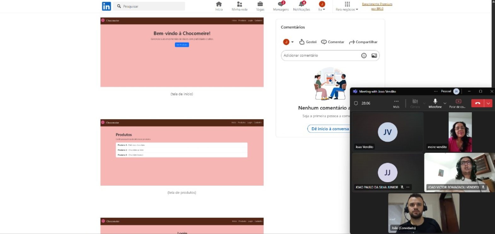
      <br>
      Apresentando as telas do site através do perfil no linkedin
    </td>
    <td align="center">
      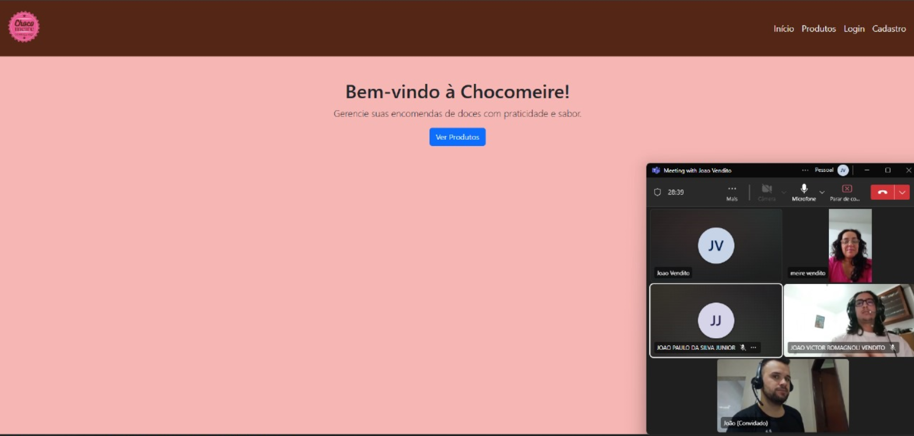
      <br>
      Apresentando tela inicial do site
    </td>
  </tr>
</table>

<table>
  <tr>
    <td align="center">
      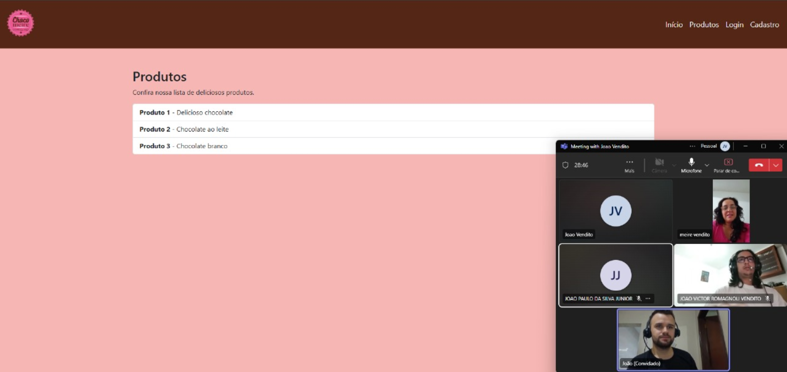
      <br>
      Apresentando e explicando como faremos a página de produtos
    </td>
    <td align="center">
      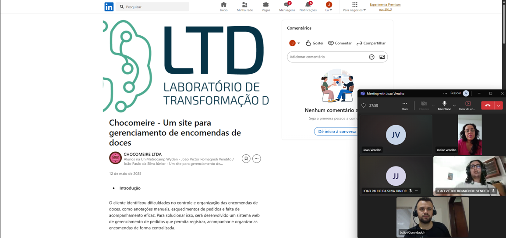
      <br>
      Apresentando perfil criado no linkedin
    </td>
  </tr>
</table>

### Lista de presença
| Nome                      | Função             |
|---------------------------|--------------------|
| Edimeire Bezerra Romagnoli| Cliente/Confeiteira|
| João Victor R. Vendito     | Desenvolvedor      |
| João Paulo da Silva Júnior | Desenvolvedor      |

---

## 10. Divulgação 📢 

### LinkedIn do Projeto

www.linkedin.com/in/chocomeire-ltda-2a1a60360

### Seminário de Projetos de Software

<table>
  <tr>
    <td align="center">
      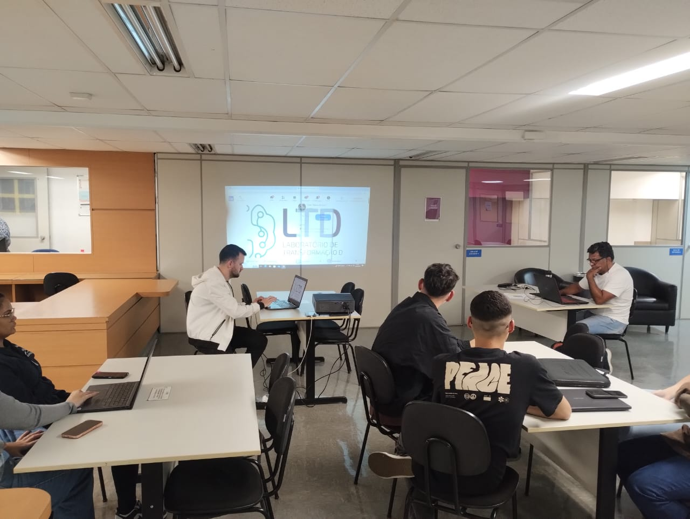
      <br>
      Foto do ambiente de apresentação
    </td>
    <td align="center">
      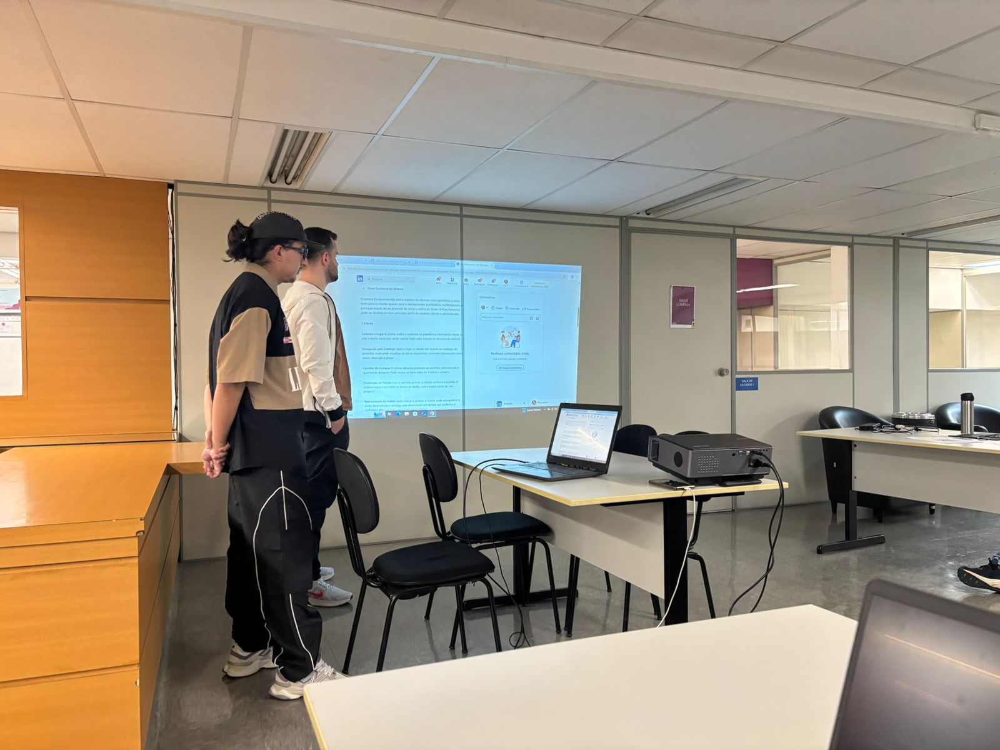
      <br>
      Apresentando sobre a marca
    </td>
  </tr>
  <tr>
    <td align="center">
      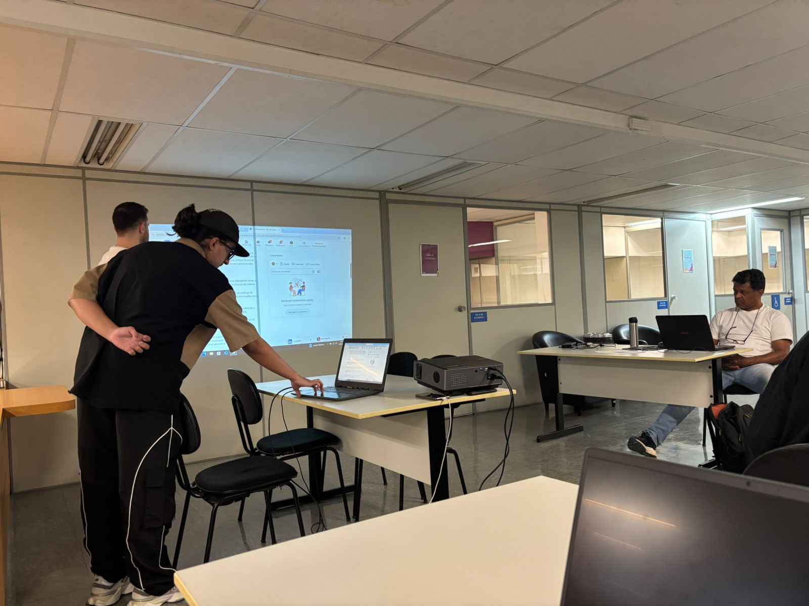
      <br>
      Apresentando sobre o projeto
    </td>
    <td align="center">
      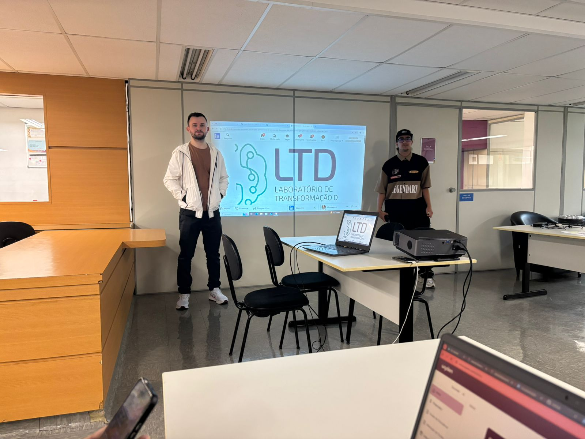
      <br>
     Início da apresentação
    </td>
  </tr>
</table>

<p align="center">
  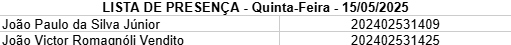
  <br>
  Lista de presença do evento
</p>

---

## 11. Carta de Apresentação ✉️

Vimos por meio desta apresentar o grupo de acadêmicos do **Centro Universitário Unimetrocamp**, localizado na **Av. Sales de Oliveira, 1661 - Campinas - SP**, a fim de convidá-lo a participar de uma atividade extensionista associada ao componente curricular **ARA0075 - Programação Orientada à Objeto**, sob responsabilidade do(a) orientador(a) **Prof. Kesede Rodrigues Julio**.

Em consonância ao **Plano Nacional de Educação**, o **Centro Universitário Unimetrocamp** desenvolve o **Desenvolvimento de Software**, que, norteado pela metodologia da **Engenharia de Software**, tem por princípios:
- Diagnóstico dos problemas/demandas/necessidades;
- Participação ativa dos interessados/públicos participantes;
- Construção dialógica, coletiva e experiencial de conhecimentos;
- Planejamento de ações;
- Desenvolvimento e avaliação das ações;
- Sistematização dos conhecimentos.

Nesse contexto, a disciplina mencionada tem como escopo:
- Levantamento de requisitos;
- Planejamento dos modelos;
- Codificação dos modelos;
- Testes dos códigos;
- Homologação do MVP.

Solicitamos o apoio da **Chocomeire** para a realização das seguintes atividades:
- Diagnósticos através de reuniões agendadas;
- Análises feitas pelos integrantes do time de desenvolvimento;
- Levantamento de requisitos por meio de reuniões agendadas (online ou presencial);
- Desenvolvimento de projeto utilizando **Metodologia Ágil Scrum**;
- Mentorias com o professor da disciplina;
- Pesquisas em documentações, repositórios e plataformas de IA.

### Formalização:
Em caso de aceite, solicitamos a assinatura da **Carta de Autorização**, formalizando as atividades e informações que o(s) aluno(s) poderá(ão) ter acesso.

### Fórum de Acompanhamento:
Registramos também o convite para o **fórum semestral de acompanhamento e avaliação das atividades realizadas**, que será comunicado previamente em convite específico.

Desde já, nos colocamos à disposição para quaisquer esclarecimentos.

**Local:** Campinas, 17 de Abril de 2025  
**Assinatura:** Direção Acadêmica da IES  
**Assinatura:** Docente


---

## 12. Carta de Autorização ✍️


Eu, **Edimeire Bezerra Romagnoli**, Confeiteira da Chocomeire, autorizo a realização das seguintes atividades acadêmicas do componente extensionista **ARA0075 - Programação Orientada à Objeto**, do **Centro Universitário Unimetrocamp**, sob orientação do(a) **Prof. Kesede Rodrigues Julio**:

### Atividades Autorizadas:
- Realização de um site para gerenciamento de encomendas de doces.

#### Alunos Autorizados:
| Nome                          | Curso                   | Matrícula     |
|--------------------------------|-------------------------|--------------|
| João Victor Romagnoli Vendito  | Ciência da Computação   | 202402531425 |
| João Paulo da Silva Júnior     | Ciência da Computação   | 202402531409 |

Declaro que fui informado por meio da Carta de Apresentação sobre as características e objetivos das atividades que serão realizadas na organização/instituição/empresa a qual represento e afirmo estar ciente de tratar-se de uma atividade realizada com intuito exclusivo de ensino de alunos de graduação, sem a finalidade de exercício profissional.

### Autorizo, em caráter de confidencialidade:
- O acesso a informações e dados necessários à execução da atividade;
- O registro de imagem por meio de fotografias;
- Outro:

**Local:** Campinas, 17 de Abril de 2025  
**Assinatura:** Edimeire Bezerra Romagnoli  


---

## 13. Relato individual do processo 💬

### João Victor Romagnóli Vendito - 202402531425

Durante o desenvolvimento do projeto Chocomeire, tive a oportunidade de aplicar na prática diversos conceitos que aprendi ao longo do curso, especialmente na área de desenvolvimento web com Python e Flask. Participei ativamente na criação da estrutura do sistema, ajudando a organizar as rotas, conectar com o banco de dados SQLite e desenvolver funcionalidades essenciais para o gerenciamento das encomendas de doces. Embora tenha enfrentado algumas dificuldades com a lógica de algumas funcionalidades e com o uso de bibliotecas que ainda não dominava completamente, consegui superar esses obstáculos por meio de pesquisas, testes e colaboração com o colega. O projeto também me ajudou a entender melhor a importância da organização do código, do versionamento com Git e da comunicação em equipe. No geral, foi uma experiência bastante enriquecedora, que contribuiu para o meu crescimento tanto técnico quanto pessoal.

### João Paulo da Silva Júnior - 202402531409

No decorrer do desenvolvimento do projeto CHOCOMEIRE, pude colocar em prática o estudo sobre Python e desenvolvimento web. Estive envolvido na implementação de funcionalidades das rotas da aplicação, front-end e integração do banco de dados.
Aprendi a estruturar melhor as rotas com Flask, trabalhar com operações CRUD no banco de dados e integrar formulários HTML com o backend.Além da parte técnica, o projeto me proporcionou uma visão mais clara sobre a importância da organização do código, uso do GitHub e Jira. No final, considero que essa experiência foi fundamental para o meu desenvolvimento, como futuro programador, e profissional preparado para trabalhar de forma colaborativa.

